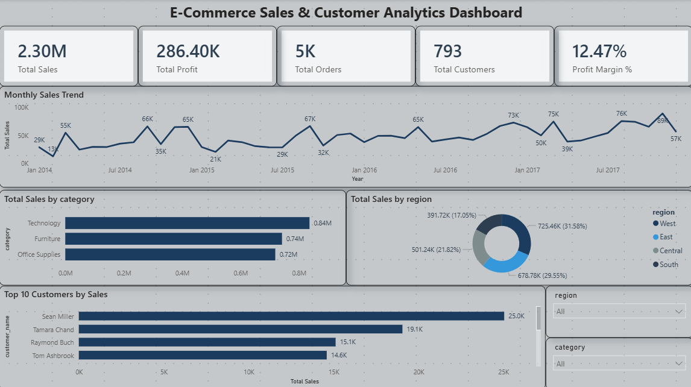

# E-Commerce Sales & Customer Analytics Dashboard

## Project Overview
This project analyzes retail sales data using MySQL, Power BI, and DAX.

## Tools Used
- MySQL
- Power BI
- DAX

## KPIs
- Total Sales
- Total Profit
- Total Orders
- Total Customers
- Profit Margin %

## Dashboard Features
- Monthly Sales Trend
- Sales by Category
- Sales by Region
- Top Customers Analysis
- Interactive Filters and Slicers

## SQL Operations
- Data Import
- Data Cleaning
- Date Conversion
- Customer Analysis
- Category Analysis
- Regional Analysis
- Monthly Sales Trend Analysis

## Dashboard Preview

## Key Insights
- Technology generated the highest sales.
- West region contributed the highest revenue.
- Profit Margin was approximately 12.47%.
- Top customers contributed significantly to overall sales.
